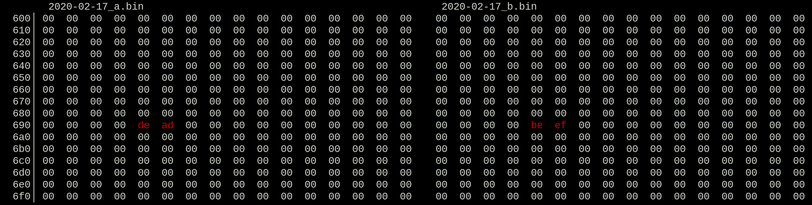

# Creamy Hex Diffs

<a href="https://github.com/AlbinoDrought/creamy-hex-diff/blob/master/LICENSE"></a>

[](./.readme/action,png)

## Installation

```sh
go get github.com/AlbinoDrought/creamy-hex-diff
```

## Usage

```sh
creamy-hex-diff <file1> <file2>
```

| Key       | Action                |
|-----------|-----------------------|
| Up        | Last line             |
| Down      | Next line             |
| Left      | Last block difference |
| Right     | Next block difference |
| Page Up   | Last block            |
| Page Down | Next block            |
| Home      | Jump to start of file |
| End       | Jump to end of file   |
| Ctrl-c    | Exit                  |
| q         | Exit                  |
